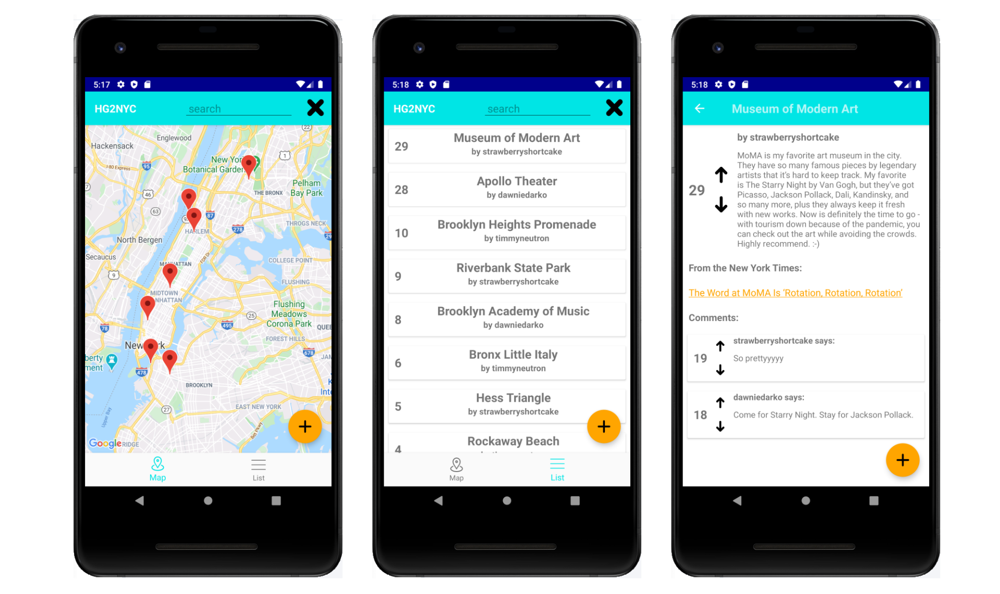

# UT Austin Android Programming Fall 2020
# Final Project: Hitchhiker's Guide to New York City

## Introduction
This is my final project for UT Austin's Android Programming class. It's a Reddit/Zagat-style app that allows users to post, comment, and vote on cool but lesser-known landmarks, fun things to do, and interesting history tidbits in my hometown of New York City, NY. Users can:

  - Post content
  - View posts in map and list views
  - Filter posts by category
  - Comment on posts
  - Vote on posts and comments

## Concepts and Classes
Concepts explored in this project:

  - Android development
  - Programming in Kotlin/Java
  - API design
  - Database design using Google Cloud Firestore
  - User authentication using Google Firebase Authentication
  - Utilizing external APIs with Retrofit

## Getting Started

To view the demo video, click [here](https://youtu.be/YIDMM1x_F9U).
